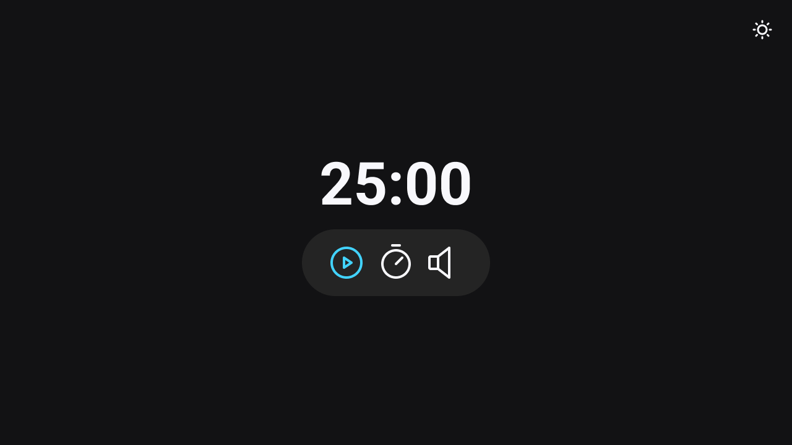
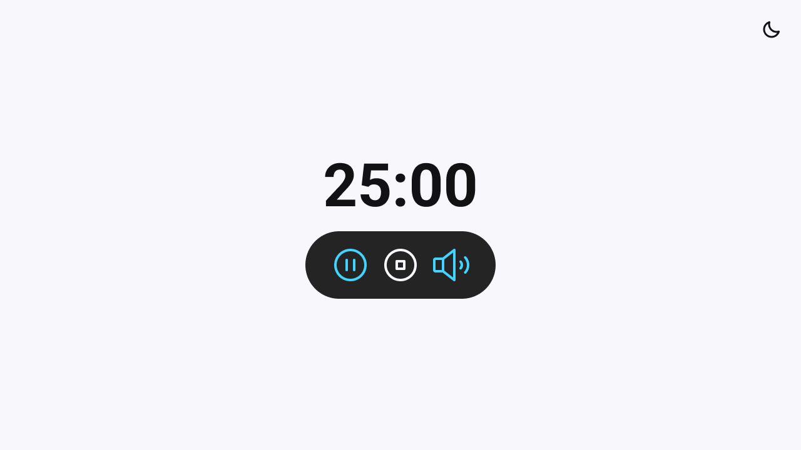

<strong><h1 align="center">Projeto Focus Timer</h1></strong>

Esse projeto tem como finalidade colocar em prática JavaScript, HTML e CSS, aonde foi criado um temporazidor baseado na técnica Pomodoro, ele foi elaborado na aula do programa Explorer da Rocketseat.

## 🎨 Layout

O layout do projeto está disponível no [Figma](https://www.figma.com/design/z22O4n0W19Zx9FoUyIew64/Focus-Timer-V2-%E2%80%A2-Projeto-Explorer-(Community)?node-id=1422-28&node-type=canvas&t=aR937nV3bkHJiF1q-0)

  
  

## 🚀 Tecnologias

Esse projeto foi desenvolvido com as seguintes tecnologias:

- HTML e CSS
- JavaScript
- Git e Github
- Figma

## 🚀 Pré-requisitos

Antes de começar, você vai precisar ter instalado em sua máquina as seguinte ferramenta:

---

Feito com ♥ by [Gelzieny](https://gelzieny.dev)